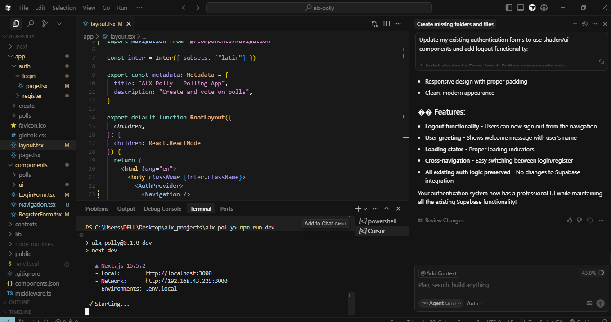
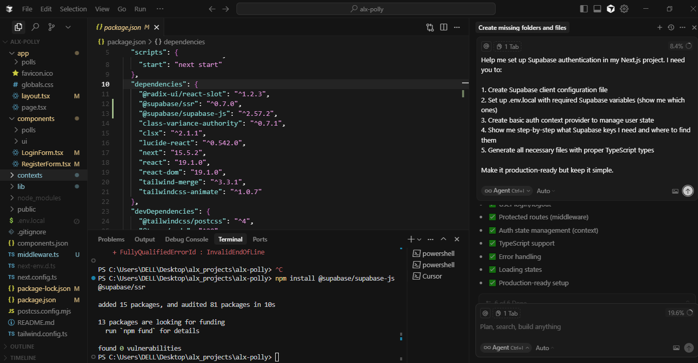
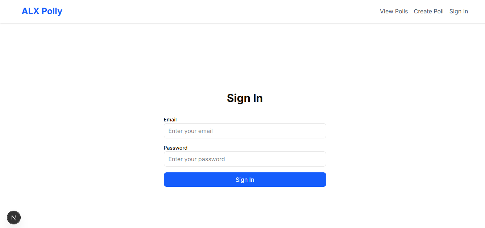
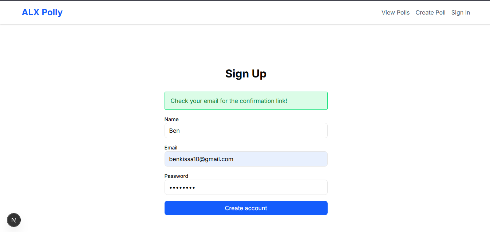

# 🗳️ ALX Polly - AI-Assisted Polling App

> **Built with Cursor AI** | **#ALX_AIDEV** | **@alx_africa**

A modern, full-stack polling application built with Next.js 15, Supabase authentication, and shadcn/ui components. This project demonstrates AI-assisted development using Cursor AI to implement a complete authentication system and user interface.

## ✨ Features

### 🔐 Authentication System
- **User Registration** - Create new accounts with email verification
- **User Login** - Secure authentication with Supabase
- **Session Management** - Persistent sessions with automatic token refresh
- **Protected Routes** - Middleware-based route protection
- **Logout Functionality** - Clean session termination

### 🎨 User Interface
- **Modern Design** - Built with shadcn/ui and Tailwind CSS
- **Responsive Layout** - Mobile-first design approach
- **Form Validation** - Client-side validation with react-hook-form and Zod
- **Loading States** - Smooth UX with loading indicators
- **Error Handling** - User-friendly error messages

### 🏗️ Technical Features
- **Next.js 15** - App Router with Server Components
- **TypeScript** - Full type safety throughout the application
- **Supabase Integration** - Backend-as-a-Service for authentication
- **Middleware Protection** - Server-side route protection
- **Context API** - Global authentication state management

## 🖼️ Screenshots


*AI-assisted development prompts for authentication implementation*


*Supabase configuration and setup guidance*


*Clean and modern login interface with form validation*


*User registration form with real-time validation*

## 🛠️ Tech Stack

- **Frontend**: Next.js 15, React 19, TypeScript
- **Styling**: Tailwind CSS, shadcn/ui
- **Authentication**: Supabase Auth
- **Form Handling**: react-hook-form, Zod validation
- **State Management**: React Context API
- **Deployment**: Vercel-ready

## 📁 Project Structure

```
alx-polly/
├── app/
│   ├── auth/
│   │   ├── login/page.tsx          # Login page
│   │   └── register/page.tsx       # Registration page
│   ├── create/page.tsx             # Create poll page
│   ├── polls/page.tsx              # View polls page
│   ├── layout.tsx                  # Root layout with AuthProvider
│   └── page.tsx                    # Home page
├── components/
│   ├── ui/                         # shadcn/ui components
│   ├── LoginForm.tsx               # Login form component
│   ├── RegisterForm.tsx            # Registration form component
│   ├── Navigation.tsx              # Navigation with auth state
│   └── polls/                      # Poll-related components
├── contexts/
│   └── AuthContext.tsx             # Authentication context
├── lib/
│   ├── supabase/
│   │   ├── client.ts               # Client-side Supabase
│   │   ├── server.ts               # Server-side Supabase
│   │   └── middleware.ts           # Auth middleware
│   ├── types/                      # TypeScript type definitions
│   └── utils.ts                    # Utility functions
├── middleware.ts                   # Next.js middleware
└── screenshots/                    # Project screenshots
```

## 🚀 Getting Started

### Prerequisites
- Node.js 18+ 
- npm or yarn
- Supabase account

### Installation

1. **Clone the repository**
   ```bash
   git clone <your-repo-url>
   cd alx-polly
   ```

2. **Install dependencies**
   ```bash
   npm install
   # or
   yarn install
   ```

3. **Set up environment variables**
   Create a `.env.local` file in the root directory:
   ```env
   NEXT_PUBLIC_SUPABASE_URL=your_supabase_url
   NEXT_PUBLIC_SUPABASE_ANON_KEY=your_supabase_anon_key
   ```

4. **Set up Supabase**
   - Create a new project in [Supabase](https://supabase.com)
   - Enable authentication in your Supabase dashboard
   - Copy your project URL and anon key to `.env.local`

5. **Run the development server**
   ```bash
   npm run dev
   # or
   yarn dev
   ```

6. **Open your browser**
   Navigate to [http://localhost:3000](http://localhost:3000)

## 🔧 Development

### Key Commands
```bash
# Start development server
npm run dev

# Build for production
npm run build

# Start production server
npm start
```

### Authentication Flow
1. **Registration**: Users can create accounts with email/password
2. **Email Verification**: Supabase sends verification emails
3. **Login**: Authenticated users can sign in
4. **Session Management**: Automatic token refresh via middleware
5. **Protected Routes**: Unauthenticated users redirected to login

## 🤖 AI-Assisted Development

This project was built using **Cursor AI** to demonstrate modern AI-assisted development practices:

### What AI Helped With:
- **Code Generation**: Complete authentication system implementation
- **Architecture Decisions**: Project structure and component organization
- **Best Practices**: Supabase integration patterns and Next.js conventions
- **Type Safety**: TypeScript interfaces and type definitions
- **UI Components**: shadcn/ui integration and responsive design
- **Documentation**: Comprehensive README and code comments

### Key Learnings:
- AI can significantly accelerate full-stack development
- Proper prompting leads to better code quality
- AI excels at implementing common patterns (auth, forms, routing)
- Human oversight ensures business logic accuracy
- AI-assisted development reduces boilerplate and setup time

## 🎯 ALX AI Development Project

This project is part of the **ALX AI Development** program, showcasing:
- Modern web development practices
- AI-assisted coding workflows
- Full-stack application architecture
- Authentication and security implementation
- Professional documentation and presentation

## 📝 License

This project is part of the ALX AI Development curriculum and is for educational purposes.

## 🤝 Contributing

This is an educational project. For questions or feedback, please reach out through ALX channels.

---

**Built with ❤️ and AI assistance** | **#ALX_AIDEV** | **@alx_africa**